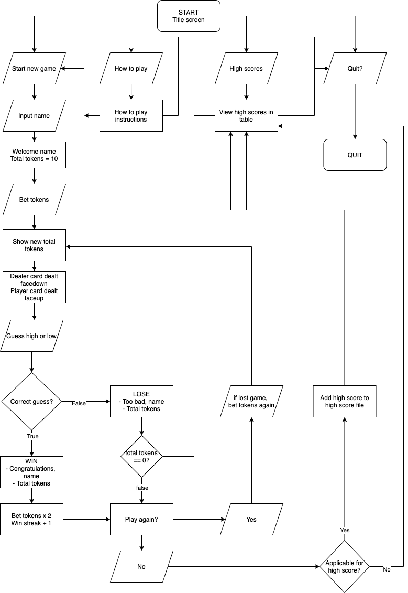

# HIGH LOW

A terminal game

## Contents

1. [Source control repository](#source-control-repository)
2. [Purpose & scope](#purpose-&-scope)
3. [Features and user interaction](#features-and-user-interaction)
4. [Control flow diagram](#control-flow-diagram)
5. [Implementation plan](#implementation-plan)
6. [How to use and install this app](#how-to-use-and-install-this-app)

## Source control repository

High Low can be downloaded from [GitHub](https://github.com/robynsdev/terminal_highlow).

## Purpose & scope

High low is a fun game where a dealer is dealt a card face down and the player is dealt a card face up. The player must decide if the dealer's card is higher or lower than their card. The deck is reshuffled every 15 rounds. Aces are the highest cards, twos are the lowest. If the same number is drawn, suits are used to judge which card is higher. Suits in order of high to low are spades, hearts, clubs, diamonds.

The challenge of the game is to get on a high score board. There is a high score board for maintaining the highest winning streak and a high score board for winning the most tokens from a start of 10 tokens.

Besides luck, the player must calculate the chances of their card being higher or lower than the dealer's by remembering the cards that have been played, possibly training their mental abilities but mainly for enjoyment.

The target audience is anyone who can use a computer. Clear instructions are given on how to install the app below. 

## Features and user interaction

1. ### Input name

   This feature allows the player to input their name. They are only able to enter letters from A-Z and up to 20 characters or they will be prompted with an error message stating "Enter an alphabet only name which is less than 20 characters long."

   They are greeted when starting the game, congratulated/commisrated when game over and their name is used to update the high score boards if a high score is obtained. These uses personalise the game and increases player satisfaction from playing. 

   

2. ### Randomised cards drawn are depleted from deck

   The cards drawn for both dealer and player are drawn from a shuffled deck and depleted. This gives the player a greater chance to win if they are able to remember previous hands and calculate the dealer's chances of having a higher or lower card compared to theirs. This gives the player a sense of luck and cleverness when playing.

   

3. ### Token betting & win streaks 

   Players start with 10 tokens and are able to bet an amount of their choosing. They are only able to input numbers and are told to "Please input a number" if the input is invalid. If the player wins the round, the pot is doubled. If the player loses the round, the pot is forefit.

   

4. ### High score boards

   The high score boards stores the top 5 winning streaks and top 5 total tokens. They are viewable by selection on the title screen and also when ending the game. If a winning player decides to end the game, the game checks if they are eligible for both high score boards and updates both as necessary.

   

5. ### Restart game

   At the end of each round, the player has the option to choose to play another round or stop playing. 

   If they lost the last round, still have tokens and want to continue playing, they are given the option to bet again and they enter the loop again.

   If they won the last round and want to continue playing, they are given the option to cash in to add the pot they won to their total tokens instead of risking it in the next round. They then have to enter a new bet and they enter the loop again.

   If they want to stop playing, they are shown the high score screen. If the player won the last round, the game will check if they have obtained a high score and if they did, add their name and score to the respective high score table.

## Control flow diagram

## Implementation plan

   The implementation plan for this project was developed on [Trello](https://trello.com/b/muiMqkFs/terminal-app-highlow).

## How to use and install this app

Anyone with access to bash can use and install this app. To use and install this app

1. [Download](https://www.ruby-lang.org/en/downloads/) and [install](https://www.ruby-lang.org/en/documentation/installation/) Ruby
2. [Download](https://github.com/robynsdev/terminal_highlow) the zip file of the app by clicking 'Code' then 'Download ZIP'
3. Unzip the folder
4. Navigate to the lib directory of the folder using bash
5. Type ./run_high_low.sh into bash

